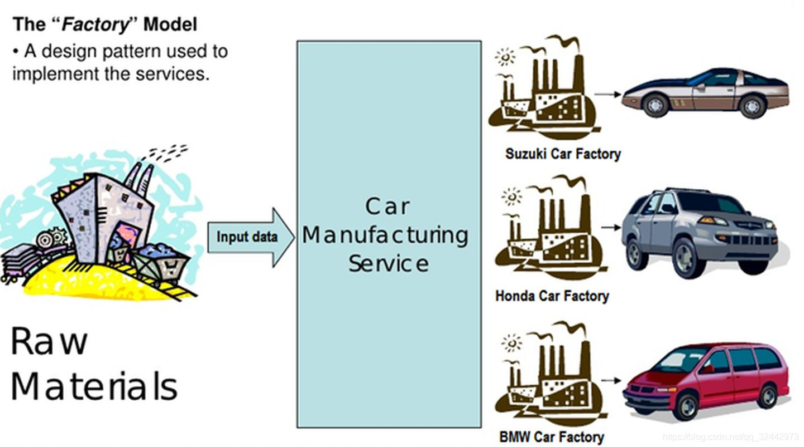

# JavaScript每日3+1

## 判断数据类型的方法--typeof、instanceof 和 Object.prototype.toString

### typeof

* 检测返回结果是一个字符串
* 优点：使用起来简单，基本数据类型都可以有效检测，引用数据类型也可以检测出来
* 局限性：
1）、NaN/Infinity 都是数字类型的，检测结果都是“number”;
2)、typeof null的结果是“object”
（这是浏览器的BUG：所有的值在计算中都以二进制编码储存，浏览器中把前三位000的当作对象，而null的二进制前三位是000，所以被识别为对象，但是他不是对象，他是空对象指针，是基本类型值）
3)、typeof 普通对象/数组对象/正则对象...， 结果都是“object”，**这样就无法基于typeof 区分是普通对象还是数组对象``...等了**

### instanceof

* 要求检测的实列必须是对象数据类型的
* 基本数据类型的实列是无法基于它检测出来的（字面量方式创建的不能检测，构造函数创建的可以正常检测）
* 不管是数组对象还是普通对象，都是Object实列，检测结果都是true，所以无法基于这个结果判断是否为普通对象

```js
// instanceof检测的实例必须都是引用数据类型的，它对基本数据类型值操作无效
console.log(10 instanceof Number); //=>false
console.log(new Number(10) instanceof Number); //=>true

console.log(new Array(10) instanceof Array); //=>true
console.log(new Array(10) instanceof Object); //=>true
console.log(new Object(10) instanceof Object); //=>true

// instanceof检测机制：验证当前类的原型prototype是否会出现在实例的原型链__proto__上，只要在它的原型链上，则结果都为TRUE
function Fn() {}
Fn.prototype = Object.create(Array.prototype);
let f = new Fn;
console.log(f instanceof Array); //=>true f其实不是数组，因为它连数组的基本结构都是不具备的 
```

**注意**：它本身不能完成数据类型检测，只是利用它（检测某个实例是否属于这个类的）特征完成检测

### Object.prototype.toString.call()

* 定义：找到Object.prototype上的toString方法，让toString方法执行，并且基于call让方法中的this指向检测的数据值，这样就可以实现数据类型检测了
* 原理：
1、每一种数据类型的构造函数的原型上都有toString方法；
2、除了Object.prototype上的toString是用来返回当前实例所属类的信息（检测数据类型的），其余的都是转换为字符串的
3、对象实例.toString() ：toString方法中的THIS是对象实例，也就是检测它的数据类型，也就是THIS是谁，就是检测谁的数据类型
4、Object.prototype.toString.call([value]) 所以我们是把toString执行，基于call改变this为要检测的数据值
* 使用方法：
Object.prototype.toString.call(被检测的实例)
({}).toString.call(被检测的实例)

```js
Object.prototype.toString.call(10)
({}).toString.call(10)
({}).toString===Object.prototype.toString
```

```js
let class2type = {};
let toString = class2type.toString; //=>Object.prototype.toString

console.log(toString.call(10)); //=>"[object Number]"
console.log(toString.call(NaN)); //=>"[object Number]"
console.log(toString.call("xxx")); //=>"[object String]"
console.log(toString.call(true)); //=>"[object Boolean]"
console.log(toString.call(null)); //=>"[object Null]"
console.log(toString.call(undefined)); //=>"[object Undefined]"
console.log(toString.call(Symbol())); //=>"[object Symbol]"
console.log(toString.call(BigInt(10))); //=>"[object BigInt]"
console.log(toString.call({xxx:'xxx'})); //=>"[object Object]"
console.log(toString.call([10,20])); //=>"[object Array]"
console.log(toString.call(/^\d+$/)); //=>"[object RegExp]"
console.log(toString.call(function(){})); //=>"[object Function]" 
```

* 优点：
专门用来检测数据类型的方法，基本上不存在局限性的数据类型检测方式
基于他可以有效的检测任何数据类型的值
* 局限性：
1)、只能检测内置类，不能检测自定义类
2)、只要是自定义类返回的都是‘[Object Object]’
**注意：此方法是基于JS本身专门进行数据检测的，所以是目前检测数据类型比较好的方法**

## 回调函数

<https://blog.csdn.net/I_am_shy/article/details/136476455>
回调函数是一种特殊的函数，它作为参数传递给另一个函数，并在被调用函数执行完毕后被调用

## js有哪些内置的对象

* **Object**：JavaScript 中的所有对象都是从 Object 对象继承而来的。
* **Array**：用于创建和操作数组的对象。
* **String**：用于创建和操作字符串的对象。
* **Number**：用于创建和操作数字的对象。
* **Boolean**：用于创建和操作布尔值的对象。
* **Function**：用于创建函数的对象。
* **Date**：用于创建和操作日期的对象。
* **Math**：用于执行数学运算的对象。
* **RegExp**：用于创建和操作正则表达式的对象。
* **Error**：用于创建错误对象的对象。

## js获去URL中参数值的四种方法

### 1、现代浏览器都支持URL和URLSearchParams对象，可以很方便地从URL中提取参数

```js
// 假设当前URL为 "https://example.com/?name=John&age=30" 
const url = new URL(window.location.href); // 或者你可以直接传入一个URL字符串 
const name = url.searchParams.get('name'); // "John" 
const age = url.searchParams.get('age'); // "30" 
```

### 2、使用正则表达式

可以使用正则表达式匹配URL参数，这种方法相对较低效且复杂。

```js
function getQueryParam(name) {
    const regex = new RegExp('[?&]' + name + '=([^&#]*)', 'i');
    const results = regex.exec(window.location.href);
    return results ? decodeURIComponent(results[1]) : null;
}

// 假设当前URL为 "https://example.com/?name=John&age=30"
const name = getQueryParam('name'); // "John"
const age = getQueryParam('age'); // "30"
```

### 3、使用split和reduce

可以通过split方法手动拆分查询参数，并用reduce将其转化为对象

```js
function getQueryParams() {
  return window.location.search
    .substring(1) // 去掉 ?
    .split('&') // 按 & 拆分
    .reduce((params, param) => {
      const [key, value] = param.split('=');
      params[decodeURIComponent(key)] = decodeURIComponent(value || '');
      return params;
    }, {});
}

// 假设当前URL为 "https://example.com/?name=John&age=30"
const params = getQueryParams();
const name = params['name']; // "John"
const age = params['age']; // "30"
```

### 4、使用locasion.search和自定义函数

```js
function getQueryParameter(name) {
  const params = new URLSearchParams(location.search);
  return params.get(name);
}

// 假设当前URL为 "https://example.com/?name=John&age=30"
const name = getQueryParameter('name'); // "John"
const age = getQueryParameter('age'); // "30"
```

## JavaScript作用域的理解

<https://segmentfault.com/a/1190000018513150>
作用域是指在代码中变量和函数的可访问范围。作用域决定了程序中变量、函数是否可以在当前环境中被访问修改。作用域直接影响代码的执行逻辑和变量的生命周期。在JS中作用域主要分为三种类型：全局作用域、函数作用域、块级作用域。

### 为什么引入作用域的概念

主要是为了提升代码的可维护性、安全性和避免冲突，确保变量和函数能够在适当的范围内被访问和使用。

### 全局作用域

全局作用域是指在代码的任何地方都可以访问的变量。这些变量在全局对象上定义，并且在整个代码期间都存在。常见的全局对象包括浏览器中的window对象和Node.js中global对象。
**注意**：滥用全局变量可能导致命名冲突和难以调试的问题，因此应尽量避免不必要的全局变量。

### 函数作用域

函数作用域是指变量在函数内部定义，并且只能在该函数内部访问，每调用一次函数都会创建新的作用域。函数执行完毕后，局部变量将被销毁。使用var定义的变量具有函数作用域，存在变量提升问题（变量声明被提升到函数顶部，但赋值不提升）。

```js
//变量提升问题
console.log(testParams); //undenfined
var testParams = '123456789' 

console.log(testParams2); //Cannot access 'testParams2' before initialization
let testParams2 = '123456789'
```

### 块级作用域

块级作用域是指变量在代码快{}内定义，并且只能在改代码块内访问。使用let和const定义的变量具有块级作用域。

```js
if (true) {
  var testParams4 = '44444'
  let testParams3 = '33333'
  console.log(testParams3); //33333
  console.log(testParams4); //44444
}
console.log(testParams4); //44444
console.log(testParams3); //testParams3 is not defined
```

## 什么是闭包？优缺点分别是什么？

闭包，是一个具有封闭功能与包裹功能的一个结构或空间。在js中，函数可以构成闭包。因为函数在当前的作用域中是一个封闭的结构，具有封闭性；同时根据作用域规则，只允许函数内部访问外部的数据，而外部无法访问函数内部的数据，即函数具有封闭的对外不公开的特性，就像把一个东西包裹起来一样，因此函数可以构成闭包。
有点难理解，简单来说，就是能够读取其他函数内部变量的函数，再简洁一点就是：定义在一个函数内部的函数。

```js
function outerFunction() {
  let outerVariable = 'I am outer'; // 外部函数作用域中的变量

  function innerFunction() {
    console.log(outerVariable); // 内部函数访问外部函数作用域中的变量
  }

  return innerFunction; // 返回内部函数
}

const myClosure = outerFunction();
myClosure(); // 输出：I am outer
```

```js
var name = "The Window";
　　var object = {
　　　　name : "My Object",
　　　　getNameFunc : function(){
　　　　　　return function(){
　　　　　　　　return this.name;
　　　　　　};
　　　　}
　　};
alert(object.getNameFunc()()); //The Window

var name = "The Window";
　　var object = {
　　　　name : "My Object",
　　　　getNameFunc : function(){
　　　　　　var that = this;
　　　　　　return function(){
　　　　　　　　return that.name;
　　　　　　};
　　　　}
　　};
alert(object.getNameFunc()()); //My Object


// 第一个alert：返回的函数里面返回this.name，因为后续没有引用，所以getNameFunc直接释放了，因此这里的this存在丢失问题，这时候直接指向了window，于是alert的是The Window。
// 另一种理解方式：return function(){return this.name;}匿名函数没调用对象就指向global
// 第二个alert：返回的函数里面返回that.name，但是这里的that在getNameFunc有定义，因此getNameFunc就没有被释放，然后存在在作用域中，于是可以通过作用域链向上查找that，先找到的是object作用域，于是alert的是My Object。

// 第二个alert体现的就是闭包的作用，能够保持作用域链的引用，可以在全局环境下访问到函数的内部作用域。
```

### 4、闭包的优缺点

#### 1、优点

* 保护变量：闭包可以起到封装变量的作用，避免变量被外部意外修改。
* 延长变量寿命：即使外部函数执行完毕，闭包仍然可以访问外部函数作用域中的变量，延长了变量的生命周期。
* 实现模块化：闭包可以模拟私有方法和属性，帮助我们实现模块化的编程结构。

#### 2、缺点

* 内存泄漏：如果闭包被错误使用，可能会导致内存泄漏，因为闭包会使得包含该闭包的函数中的变量无法被垃圾回收。
* 性能消耗：闭包会对内存产生额外的消耗，可能会影响性能，尤其在闭包嵌套过深的情况下。

##### 解决内存泄漏的方法

* 1、及时释放外部变量：确保在不再需要使用闭包中的外部变量时，将其释放或设置为 null，以便垃圾回收器可以正确回收内存。
* 2、使用 WeakMap 或 WeakSet：这些是 JavaScript 中的弱引用集合，不会阻止垃圾回收器对其所引用的对象进行回收，可以用来存储闭包中的外部变量，避免内存泄漏。
* 3、避免创建不必要的闭包：尽量减少闭包的使用，特别是在不需要保持状态或上下文的情况下。
* 4、注意循环引用：闭包中的变量可能形成循环引用，导致内存无法正确释放，要特别注意避免这种情况

## 深拷贝&浅拷贝&Console

**浅拷贝**是创建一个新对象，这个对象有着原始对象属性值的拷贝。如果属性是基本类型，拷贝的就是基本类型的值，如果属性是引用类型，拷贝的是内存地址 。如果不进行深拷贝，其中一个对象改变了对象的值，就会影响到另一个对象的值。如：`Object.assign(obj1, obj2)`
**深拷贝**是将一个对象从内存中完整的拷贝一份出来,从堆内存中开辟一个新的区域存放新对象,且修改新对象不会影响原对象。如：`JSON.parse(JSON.stringify(obj))`

<https://developer.mozilla.org/zh-CN/docs/Web/API/console/log_static#%E8%BE%93%E5%87%BA%E5%AF%B9%E8%B1%A1>
不要使用 console.log(obj)，而应该使用 console.log(JSON.parse(JSON.stringify(obj)))。
这样可以确保你所看到的 obj 的值是当前输出的值。否则，大多数浏览器会提供一个随着值的变化而不断更新的实时视图。这可能不是你想要的。

```js
function testConsol() {
  let obj1 = { a: 1 }
  let obj2 = { b: { data: 1 } }
  Object.assign(obj1, obj2)
  console.log('obj1', obj1); // {"a": 1,"b": 10}
  console.log('obj1', JSON.parse(JSON.stringify(obj1))); //{"a": 1,"b": {"data": 1}}
  obj1.b = 10
}
```

## 返回到顶部有哪些方法

### 动态显示滚动按钮

“回到顶部”按钮并不是一直显示的，而是滚动到一定值才会出现的，因此应该在window.onscroll里定义一个判断事件控制其是否显示。

```js
window.onscroll = function () {
  var currentHeight =
    document.documentElement.scrollTop ||
    window.pageYOffset ||
    document.body.scrollTop;
  // 页面滚动超过300px就显示
  if (currentHeight > 300) {
    document.getElementById('backtop').style.display = 'block'
  } else {
    document.getElementById('backtop').style.display = 'none'
  }
}
```

### 直接回到顶部

#### 锚点

最简单的方法。给顶部的div一个id，点击直接回到这个div元素，但是URL上会出现#top.

```html
<div id="top"></div>
......
<a href="#top">回到顶部</a>
```

#### scrollTo函数

控制滚动条回到指定位置，第一个参数是距离页面左端的距离，第二个参数是距离页面顶部的距离。
`<a href="javascript:scrollTo(0, 0)">回到顶部</a>`

#### scrollTop函数

控制滚动条垂直偏移

```js
<a onclick="byScrollTop()">回到顶部</a>
......
function byScrollTop() {
  document.documentElement.scrollTop = 0;
  window.pageYOffset = 0; // 兼容ios
  document.body.scrollTop = 0; // 兼容低版本ie
}
```

#### scrollBy函数

该方法可把内容滚动指定的像素。第一个参数只想右滚动的像素，第二个参数指向下滚动的参数，负数可使方向相反。

```js
<a onclick="byScrollBy()">回到顶部</a>
......
function byScrollBy() {
  var topHeight =
    document.documentElement.scrollTop ||
    window.pageYOffset ||
    document.body.scrollTop;
  scrollBy(0, -topHeight);
}
```

### 间接回到顶部

#### 定时器实现滚动动画

通过定时器实现固定速度的自动滚动动画效果。但是这样会有个问题，就是当页面内容十分多的时候，这个时候离顶部已经有很长一段距离了。如果还是一个固定速度的话，可能会长达10秒钟，这对用户体验来说是不友好的。

```js
<a onclick="scrollToTop()">回到顶部</a>
......
function scrollToTop() {
  var topHeight =
    document.documentElement.scrollTop ||
    window.pageYOffset ||
    document.body.scrollTop;
  scrollBy(0, -100);
  // 模拟鼠标向上滚动事件
  scrolldelay = setTimeout('scrollToTop()', 50);
  // 清除滚动事件，避免无法向下移动
  if (topHeight === 0) {
    clearTimeout(scrolldelay);
    scrolldelay = null;
  }
}
```

定时器实现滚动动画-改良版
基于上面这个问题，我们可以设置一个速度的最小值，让滚动速度从快到慢，但也不至于过慢。

```js
function scrollToTop() {
  var topHeight =
    document.documentElement.scrollTop ||
    window.pageYOffset ||
    document.body.scrollTop;
  var speed = topHeight / 10 > 100 ? topHeight / 10 : 100;
  scrollBy(0, -speed);
  // 模拟鼠标向上滚动事件
  scrolldelay = setTimeout('scrollToTop()', 50);
  // 清除滚动事件，避免无法向下移动
  if (topHeight === 0) {
    clearTimeout(scrolldelay);
    scrolldelay = null;
  }
}
```

### 常用的几种设计模式

<https://cloud.tencent.com/developer/article/1627336>
<https://blog.csdn.net/qq_32442973/article/details/119757216>
设计模式是对软件设计开发过程中反复出现的某类问题的通用解决方案。设计模式更多的是指导思想和方法论，而不是现成的代码，当然每种设计模式都有每种语言中的具体实现方式。学习设计模式更多的是理解各种模式的内在思想和解决的问题，毕竟这是前人无数经验总结成的最佳实践，而代码实现则是对加深理解的辅助。
设计模式可分为三大类：

* 1、**结构型模式（Structural Patterns）**：通过识别系统中组件间的关系来简化系统的设计。
* 2、**创建型模式（Creational Patterns）**：处理对象的创建，根据实际情况使用合适的方式创建对象。常规的对象创建方式可能会导致设计上的问题，或增加设计的复杂度。创建型模式通过以某种方式控制对象的创建来解决问题。
* 3、**行为型模式（Behavuoral Patterns）**：用于识别对象之间常见的交互模式并加以实现，如此，增加了这些交互的灵活性。

#### 创建型模式

顾名思义，这些模式都是用来创建实例对象的。


```js
// 汽车构造函数
function SuzukiCar(color) {
  this.color = color;
  this.brand = 'Suzuki';
}
 
// 汽车构造函数
function HondaCar(color) {
  this.color = color;
  this.brand = 'Honda';
}
 
// 汽车构造函数
function BMWCar(color) {
  this.color = color;
  this.brand = 'BMW';
}
 
// 汽车品牌枚举
const BRANDS = {
  suzuki: 1,
  honda: 2,
  bmw: 3
}
 
/**
 * 汽车工厂
 */
function CarFactory() {
  this.create = (brand, color)=> {
    switch (brand) {
      case BRANDS.suzuki:
        return new SuzukiCar(color);
      case BRANDS.honda:
        return new HondaCar(color);
      case BRANDS.bmw:
        return new BMWCar(color);
      default:
        break;
    }
  }
}
```

使用工厂

```js
const carFactory = new CarFactory();
const cars = [];
 
cars.push(carFactory.create(BRANDS.suzuki, 'brown'));
cars.push(carFactory.create(BRANDS.honda, 'grey'));
cars.push(carFactory.create(BRANDS.bmw, 'red'));
 
function sayHello() {
  console.log(`Hello, I am a ${this.color} ${this.brand} car`);
}
 
for (const car of cars) {
  sayHello.call(car);
}
```

输出结果

```js
Hello, I am a brown Suzuki car
Hello, I am a grey Honda car
Hello, I am a red BMW car
```

#### 单列模式

实际应用场景：<https://segmentfault.com/a/1190000013864944>

单：指的是一个；例：指的是创建的实例。
单例：指的是创建的总是同一个实例。也就是使用类创建的实列始终是相同的。

```js
class Person{
  constructor(){}
}
 
let p1 = new Person();
let p2 = new Person();
 
console.log(p1===p2) //false
```

上面这段代码，定义了一个Person类，通过这个类创建了两个实例，我们可以看到最终这**两个实例是不相等**的。也就是说，通过同一个类得到的实例不是同一个(这本就是理所应当)，**但是如果我们想始终得到的是同一个实例，那么这就是单例模式**。那么下面就该介绍如何实现单例模式了：
想要实现单列模式，需要注意两点：

* 1、需要使用return。使用new的时候如果没有手动设置return，那么会默认返回this。但是，我们这里要使得每次返回的实例相同，也就是需要手动控制创建的对象，因此这里需要使用return。
* 2、我们需要每次return的是同一个对象。也就是说实际上在第一次实例的时候，需要把这个实例保存起来。在下一个实例的时候，直接return这个保存的实例。

```js
const Person = (function(){
  let instance = null;
  return class{
    constructor(){
      if(!instance){
        //第一次创建实例，那么需要把实例保存
        instance = this;
      }else{
        return instance;
      }
    }
  }
})()
let p3 = new Person();
let p4 = new Person();
console.log(p3===p4)  //true
```

从上面的代码中，我们可以看到在闭包中，使用instance变量来保存创建的实例，每次返回的都是第一次创建的实例。这样的话就实现了无论创建多少次，创建的都是同一个实例，这就是单例模式。

#### 原型模式

<https://juejin.cn/post/6968822899981418527>
原型模式是用于创建对象的一种模式，我们不需要知道这个对象的具体类型，而是直接找到一个对象，通过克隆来创建一个一模一样的对象，在js中我们可以使用**Object.create**方法来实现克隆。通俗点讲就是创建一个共享的原型，并通过拷贝这些原型创建新的对象。

举例：假如我们在一个游戏的兵工厂里批量生产机器人，每个机器人都有默认的血量100和等级1。现在我们的间谍在敌方工厂中窃取到一些核心技术并运用到我方机器人中，每个默认的参数变成血量200和等级2。
用代码表示如下：

```js
var Machine = function(){
    this.blood = 100;
    this.level = 1;
}

var machine = new Machine();
machine.blood = 200;
machine.level = 2;

var cloneMachine = Object.create(machine);

console.log(cloneMachine);
```

这样，我们每次调用 Object.create(machine) 就相当于生产出一个战争机器人，并且生产出来的机器人都是升级后的机器人
我们也可以看到，通过调用Object.create方法，就可以快捷地创建一个新的对象，他是通过克隆的方式创建对象的。

## typeof('abc')和typeof 'abc'都是string, 那么typeof是操作符还是函数？

在JavaScript中，typeof 是一个一元操作符，而不是一个函数。尽管它看起来像是一个函数，因为你可以使用它来“调用”一个值（例如 typeof 'abc'），但实际上它并不符合函数的定义。

一个重要的区别是，如果你试图在不传递任何参数的情况下“调用” typeof（例如 typeof()），JavaScript会抛出一个语法错误，而不是返回一个表示“无参数”或“undefined”的结果。这是因为 typeof 需要一个操作数来告诉它要检查什么类型的值。

相比之下，如果你尝试对一个真正的函数做同样的事情（例如 Math.max()），它通常会返回一个默认值（在这种情况下，Math.max() 会返回 -Infinity），或者如果函数被定义为不接受任何参数则可能抛出一个错误，但这是一个运行时错误，而不是语法错误。

在后面添加括号其实是改变计算优先级，和四则运算中的括号可以等效理解。简单举例：

```js
typeof 123 //"number"
typeof 123+'abc'// "numberabc"
typeof(123+'abc') // "string"
```

所以，尽管 typeof 的语法可能会让你觉得它像一个函数，但实际上它是一个操作符，用于确定其操作数的类型。

## 你理解的use strict是什么？使用它有什么优缺点？

use strict指令是Javascript的一种编译指示，用于在脚本或函数级别启用严格模式。在严格模式下，Javascript引擎会对代码进行更严格的语法和运行时检查，从而消除一些常见的Javascript陷阱，并提高代码的质量、可读性和安全性。
优点：

* 消除了一些JavaScript的静默错误：在非严格模式下，一些错误会被JavaScript引擎静默的忽略，这使得调试变得困难。严格模式会将这些静默错误转换为显式错误，方便开发者发现和修复。例如：在非严格模式下，将值赋值给未声明的变量会隐式地创建一个全局变量。在严格模式下，这会抛出一个错误。
* 禁止使用with语句：with语句会动态的改变作用域链，这回降低代码的可读性和性能，并增加调试的难度。严格模式禁止使用with语句。
* 更安全的eval()：在严格模式下，eval()函数创建的变量不会泄漏到外部作用域。
* 简化了变量查找：严格模式下，JavaScript引擎可以更有效地优化变量查找，从而提高代码的性能。
* 禁止使用arguments.callee：arguments.callee指向当前正在执行的函数。在严格模式下，禁止使用arguments.callee，因为它会妨碍代码的优化。推荐使用具名函数表达式代替。
* 禁止使用this指向全局对象：在非严格模式下，当函数被直接调用时this指向全局对象。在严格模式下，this的值为undefined。这有助于避免一些常见的错误，例如意外的修改全局对象。
* 不允许重复的属性名/参数名：对象字面量和函数例表中不允许出现重复的名称。这有助于避免一些难以发现的错误。
* 保留了一些关键字：严格模式保留了一些关键字，例如implements，interface，let，package，protected，public，static和yield，为未来的JavaScript版本做准备。
缺点：
* 兼容性问题：一些老版本的浏览器可能不支持严格模式。如果你的代码需要兼容这些浏览器，那么使用严格模式可能会导致问题。然而，现在绝大对数现代浏览器都支持严格模式，这已经不是一个很大的问题了。
* 代码更加严格：严格模式会强制执行一些更严格的规则，这可能会导致一些以前可以正常运行的代码出现错误。这需要开发者适应并修改代码，但从长远来看，这有助于提高代码质量。
* 调试可能更复杂：对于不熟悉严格模式的开发者来说，一开始调试可能会更复杂，因为一些以前被忽略的错误现在会被抛出。然而一旦熟悉了严格模式的规则，调试反而会变得更容易，因为错误能够被更早的发现和定位。

总的来说，严格模式的优点远大于缺点。它可以帮助开发者编写更健壮、更易于维护和安全的JavaScript代码。强烈建议在新的JavaScript项目中使用严格模式。